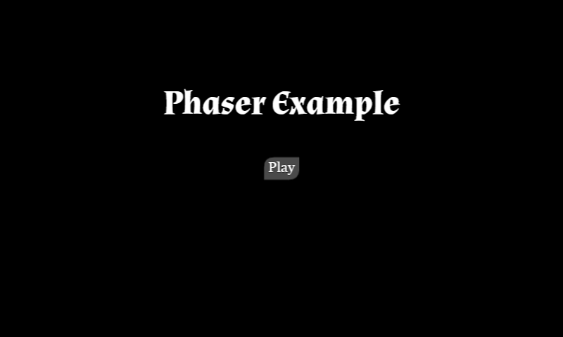

# Phaser-ES2016-Webpack Boilerplate

:star2: Start a Phaser.js project using Webpack and ECMAScript 2016 syntax.

## Features &#x2714;

* [x] Phaser v2.10.0 (Community Edition)
* [x] Webpack v3.10.0 + Dev Server v2.11.1
* [x] BabelJS Env (ECMAScript 2015 + ECMAScript 2016 + Stage 0 of ECMAScript 2017)
* [x] [super-event-emitter](http://github.com/piecioshka/super-event-emitter)
 v4.1.4 as event management
* [x] Typings (Phaser, super-event-emitter) for syntax highlighters
* [x] Task for count line of code (LOC)
* [x] Simple structure for app: `constants/`, `models/`, `states/`
* [x] Example map (build in Tiled)
* [x] Static directory: `public/`
* [x] Pack all images (PNGs &amp; JPGs under 25kb), Tiled map files (JSON),
 and fonts (.eot, .otf, .ttf, .woff, and .woff2 under 65kb) into a single bundle.
* [x] Custom font support
* [x] Simple, extensible UI system




## Steps to bootstrap

```
$ npm install       # install dependencies
$ npm run build     # build distribution files in public/dist/
```

or [Yarn](https://yarnpkg.com/lang/en/) can be used instead of npm in all
 cases as shown below:

```
$ yarn      # install dependencies
$ yarn run build    # build distribution files in public/dist/
```
 
 **Note:** To enable minification on builds, set `ENV = 'prod'` in `webpack.config.js`

## Development

```
$ npm run typings   # support syntax highlighters
$ npm run watch     # run Webpack to listen of file modifications
$ npm run dev       # run Webpack to listen of file modifications while serving to `localhost:3013`
```

## Misc

```
$ npm run count      # count lines of code (Linux and OSX)
$ npm run count-cmd  # count lines of code, excluding empty lines (Windows)
$ npm run clear      # remove all dist files (Linux and OSX)
$ npm run clear-cmd  # remove all dist files (Windows)
$ npm run clear-project      # remove all project files (Linux and OSX)
$ npm run clear-project-cmd  # remove all project files (Windows)
```

**Note:** If you want a true LOC count excluding comments and blank lines, use this command in Powershell:

```
(dir .\app -include *.js -recurse | select-string "^(\s*)//" -notMatch | select-string "^(\s*)$" -notMatch).Count
```

## Custom Fonts

Custom fonts are added in `app/assets/fonts/`. Follow the example set in this folder to learn how to utilize this feature.

You will notice that the example contains several different formats in the font folder (`.eot, .otf, .ttf, .woff, .woff2`).
This is to allow the widest browser support possible. Easy font converters for each format can be found at
https://everythingfonts.com/, and https://www.fontsquirrel.com/tools/webfont-generator is a good place to make sure that
the font you are converting is allowed to be converted.

## Troubleshooting

### `Uncaught TypeError: Cannot read property 'cache' of undefined`

Player sprite does not have reference to main game object.

```javascript
new Player();           // ERROR
new Player(this.game);  // OK
```

### `Uncaught TypeError: Failed to execute 'drawImage' on 'CanvasRenderingContext2D': The provided value is not of type '(HTMLImageElement or HTMLVideoElement or HTMLCanvasElement or ImageBitmap)'`

List of used tileset in map should be defined after map setup.

```javascript
this.map = this.add.tilemap('example-map');
this.map.addTilesetImage('street');     // MUST BE ADDED
```

### Custom Fonts Don't Load

Make sure you are using the correct font name as specified in `app/assets/fonts/fonts.css`. If the font family name is
different than the font's filename, using the filename will not load the font:

```
@font-face {
    font-family: 'ExampleFont'; /* <-- This is the name to use in Phaser. */
    src: url('./Almendra/Almendra-Bold.eot');
    src: url('./Almendra/Almendra-Bold.eot?#iefix') format('embedded-opentype'),
    url('./Almendra/Almendra-Bold.woff2') format('woff2'),
    url('./Almendra/Almendra-Bold.woff') format('woff'),
    url('./Almendra/Almendra-Bold.ttf') format('truetype'),
    url('./Almendra/Almendra-Bold.otf') format('opentype');
    font-weight: normal;
    font-style: normal;
}
```

### Audio Files

Import audio files to get their path and use the path variable to call the audio file,
  the same way as images in `/app/states/loading-state.js`.

## License

[The MIT License](http://mit-license.org) @ 2016
